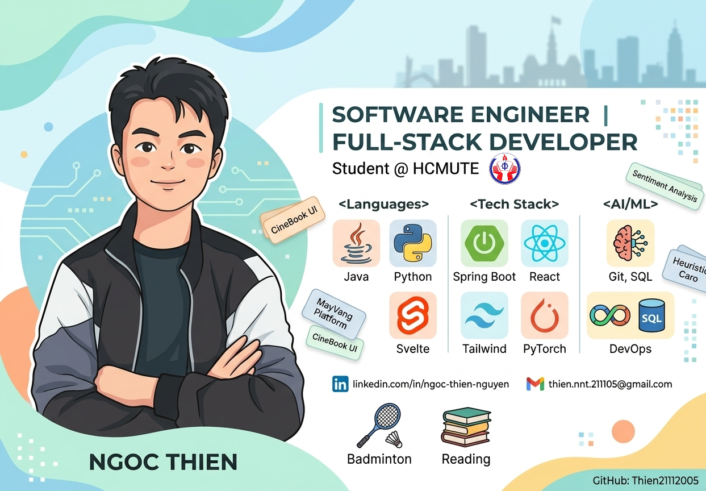

  

# Hi there, I'm Ngoc Thien! 

  

  
  
  
  

---

##  About Me

-  **Nguyen Ngoc Thien** — Software Engineering student at **HCMUTE** (Ho Chi Minh City University of Technology and Education).
-  Focus: **Full-Stack Developer** & **Software Engineer**.
-  Research Interests: **Machine Learning**, **AI Algorithms** (Heuristic Search), and **Object-Oriented System Design**.
-  Currently building: High-concurrency systems and high-fidelity, minimalist UIs.
-  Outside of coding: I enjoy playing **Badminton** and **Reading books**.
-  Contact me via Email: **[thien.nnt.211105@gmail.com](mailto:thien.nnt.211105@gmail.com)**

---

##  Tech Stack & Tools

###  Languages

  
  
  
  

###  Backend

  
  
  

###  Frontend

  
  
  
  

###  Database & DevOps

  
  
  
  

###  AI / ML

  
  
  

---

##  GitHub Stats

   
  
  
    
  

---

##  Featured Projects

<table>
  <tr>
    <td width="50%" valign="top">
      <h3> CineBook UI Kit</h3>
      
A high-fidelity, interactive HTML/Tailwind prototype for a modern cinema platform. Ready for Concurrency (Redis Redlock) & AI Chatbot integration.

      

        
        
      

      

        
         
        
      

    </td>
    <td width="50%" valign="top">
      <h3> MayVang Platform</h3>
      
An advanced full-stack hotel/booking management system (upgraded version). Built with a decoupled micro-architecture separating Java Backend and JS Frontend.

      

        
        
      

      

        
        
      

    </td>
  </tr>

  <tr>
    <td width="50%" valign="top">
      <h3> Sentiment Analysis</h3>
      
Final project for Machine Learning class (HCMUTE). Built a text sentiment analysis model using various Machine Learning algorithms. Decoupled into Frontend and Backend.

      

        
        
      

      

        
        
      

    </td>
    <td width="50%" valign="top">
      <h3> Heuristic Caro NxN</h3>
      
An Artificial Intelligence bot capable of playing Caro (Gomoku) on an NxN board, applying Heuristic search algorithms for optimal moves.

      

        
        
      

      

        
         
        
      

    </td>
  </tr>

  <tr>
    <td width="50%" valign="top">
      <h3> Folder Locker</h3>
      
A Windows desktop application built with C# and .NET. Designed to encrypt, lock, and secure personal directories on the local machine.

      

        
        
      

      

        
         
        
      

    </td>
    <td width="50%" valign="top">
      <h3> VietTech E-commerce</h3>
      
A comprehensive e-commerce website built for the Web Programming final project, featuring product management, cart, and checkout flows.

      

        
      

      

        
         
        
      

    </td>
  </tr>

  <tr>
    <td width="50%" valign="top">
      <h3> TickTick App Clone</h3>
      
A Java-based desktop application inspired by TickTick. A productivity tool for managing daily tasks, creating to-do lists, and tracking habits.

      

        
        
      

      

        
         
        
      

    </td>
    <td width="50%" valign="top">
      <h3> Calculator App</h3>
      
A functional, UI-rich Calculator application developed entirely in Java. Features standard arithmetic operations and a clean user interface.

      

        
      

      

        
         
        
      

    </td>
  </tr>
</table>

  

